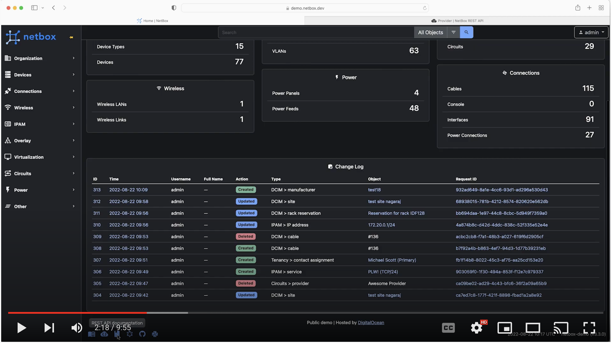

# Introduction

Hello and welcome to the first module in this NetBox 'Zero-to-Hero' course. By the end of this module you will be able to:  

- Describe what NetBox Is (and what it isn't)
- Navigate around the Web Interface and explore the data model
- Explore the REST API and start to use it to programmatically interact with NetBox 

## What NetBox Is
NetBox is designed to be the single network source of truth, providing a complete strategic picture across multiple aspects of network management. That strategic layer then acts as the backbone for layers of network automation and monitoring tools.

It’s worth noting that NetBox is designed to show the *desired* state of a network, not its operational state. As a source of truth for that desired state, NetBox is what network monitoring tools use as the basis of comparison to current reality. 

NetBox is thriving as an open source tool, with over 10,000 [GitHub](https://github.com/netbox-community/netbox) stars, 1,800 forks, and a vibrant [user community](https://github.com/netbox-community/netbox/discussions). NetBox is currently deployed on thousands of networks around the world, representing a diverse mix of use cases, market verticals, and places along the automation journey. The user base spans some of the world’s largest and most complex telecommunications networks to smaller networks of 
just a few devices.

From the [Official NetBox Documentation](https://docs.netbox.dev/en/stable/): 
> ### The Premiere Network Source of Truth
>
>NetBox is the leading solution for modeling and documenting modern networks. By combining the traditional disciplines of IP address management (IPAM) and datacenter infrastructure management (DCIM) with powerful APIs and extensions, NetBox provides the ideal "source of truth" to power network automation. 

>### Built for Networks
>
>Unlike general-purpose CMDBs, NetBox has curated a data model which caters specifically to the needs of network engineers and operators. It delivers a wide assortment of object types carefully crafted to best serve the needs of infrastructure design and documentation. These cover all facets of network technology, from IP address managements to cabling to overlays and more.

>### Customizable & Extensible
>
>In addition to its expansive and robust data model, NetBox offers myriad mechanisms through which it can be customized and extended. Its powerful plugins architecture enables users to extend the application to meet their needs with minimal development effort.

>### Always Open
>
>Because NetBox is an open source application licensed under Apache 2, its entire code base is completely accessible to the end user, and there's never a risk of vendor lock-in. Additionally, NetBox development is an entirely public, community-driven process to which everyone can provide input.

## What NetBox Is Not
Whilst NetBox is incredibly feature rich and highly extensible, you should also understand what functionality it does NOT provide. Some examples being:  

- Network monitoring
- DNS server
- RADIUS server
- Configuration management
- Facilities management

Having said this, NetBox fits into the Network Monitoring and Management eco-system in a way that allows it to integrate with external tools that do provide the functions listed above.

## Video  1 - Introduction to the NetBox Web Interface
The best way to understand the power of NetBox is to dive right in and start exploring, and this short video will give you a guided tour of the Web Interface: 

## Video 2 - Introduction to the NetBox REST API
For a deep dive, you can check out the NetBox [REST API documentation](https://docs.netbox.dev/en/stable/integrations/rest-api/). 
For now, let's take a quick tour of the REST API in this short video, which will help you to get up and running in no time: 

## Useful Links
- [Official NetBox Documentation](https://docs.netbox.dev/en/stable/)
- [NetBox GitHub](https://github.com/netbox-community/netbox)
- [GitHub Discussions](https://github.com/netbox-community/netbox/discussions)
- [NetBox Community Device Type Library](https://github.com/netbox-community/devicetype-library)